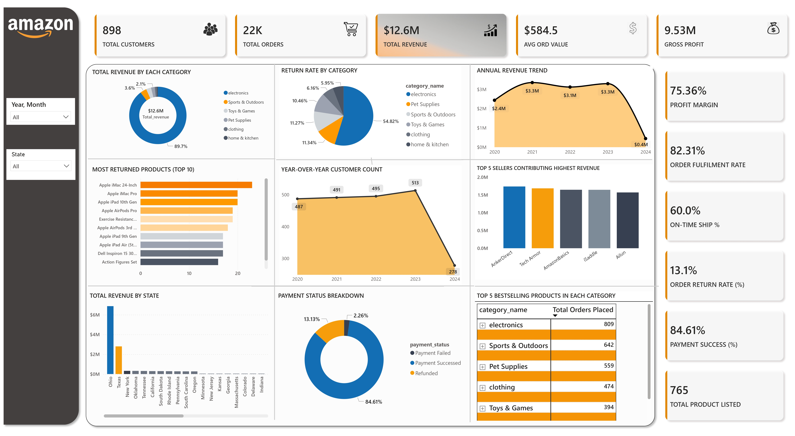

# 📊 Amazon Sales, Customer, Product , Inventory and Seller Analysis (Power BI)

## ✅ **Project Overview**
This Power BI project presents a comprehensive analysis of Amazon's sales and operations data, covering key areas like Sales Performance, Customer Behavior, Product Trends, Inventory Status, and Seller Insights. The goal is to provide actionable business intelligence to support strategic decisions in e-commerce.

---

## 🚀 **Key Business Areas Analyzed**

1. **Customer Analysis**
   - Total number of customers
   - Total orders and revenue
   - Average order value
   - Customer distribution by state
   - Year-wise customer growth

2. **Sales Analysis**
   - Total revenue and gross profit
   - Profit margin percentage
   - Sales breakdown by state, year, category, and product

3. **Order & Shipment Analysis**
   - Total orders placed
   - Order fulfillment rate
   - On-time shipping rate
   - Order return rate
   - Top 10 most returned products
   - State-wise orders and category-wise return rates

4. **Payment & Revenue Analysis**
   - Total revenue and payment success rate
   - State-wise revenue breakdown
   - Payment status analysis (success, failed, pending)
   - Refund rate trend over years

5. **Product & Inventory Insights**
   - Total products listed
   - Top 5 most ordered products per category
   - Low stock products (less than 10 units)
   - Top 10 most returned products

---

## 🧠 **Key Business Questions Answered**

- What is the total revenue and profit margin over time?
- Which states generate the highest sales and where are the most returns?
- Which products and categories are top sellers and which need improvement?
- How efficient are order fulfillment and shipping operations?
- What is the refund rate and how successful are customer payments?

---

## 📈 **Final Dashboard KPIs and Visuals**

- **Key Metrics (Cards)**: Total Revenue, Total Orders, Total Customers, Gross Profit, Profit Margin %, Fulfillment Rate
- **Sales Performance**: Sales by Year, Sales by State (Map/Bar Chart), Sales by Category and Product
- **Customer Insights**: Customers by State & Year, Average Order Value
- **Product Insights**: Top Products, Low Stock Alerts, Return Analysis
- **Order & Return Metrics**: Return Rates, Top Returned Products, Fulfillment & Shipping Rates
- **Payment Analytics**: Payment Success Rate, Refund Rate, Revenue by State

---

## 📊 **Tools & Technologies Used**

- **Power BI Desktop** — for dashboard creation and visualization
- **Power Query** — for data transformation and modeling
- **DAX (Data Analysis Expressions)** — for creating dynamic KPIs and measures

---

## 🖼 **Dashboard Screenshots**

> **Main Business Dashboard**
> 

## 🧭 **How to Use This Dashboard**

1. **Open `Amazon_Business_Dashboard.pbix`** file in **Power BI Desktop**.
2. Interact with **slicers** (Year , Month, State) to explore specific business segments.
3. Click on charts to **drill down** into detailed product, sales, and customer data.
4. Analyze **return and payment performance** for operational improvements.

---

## 👋 **Contact**

If you like this project or want to collaborate on similar projects, feel free to connect:

- 📧 **Email**: smritibhattrai09@gmail.com

---

## ⭐ **If you like this project, please give it a star!**

